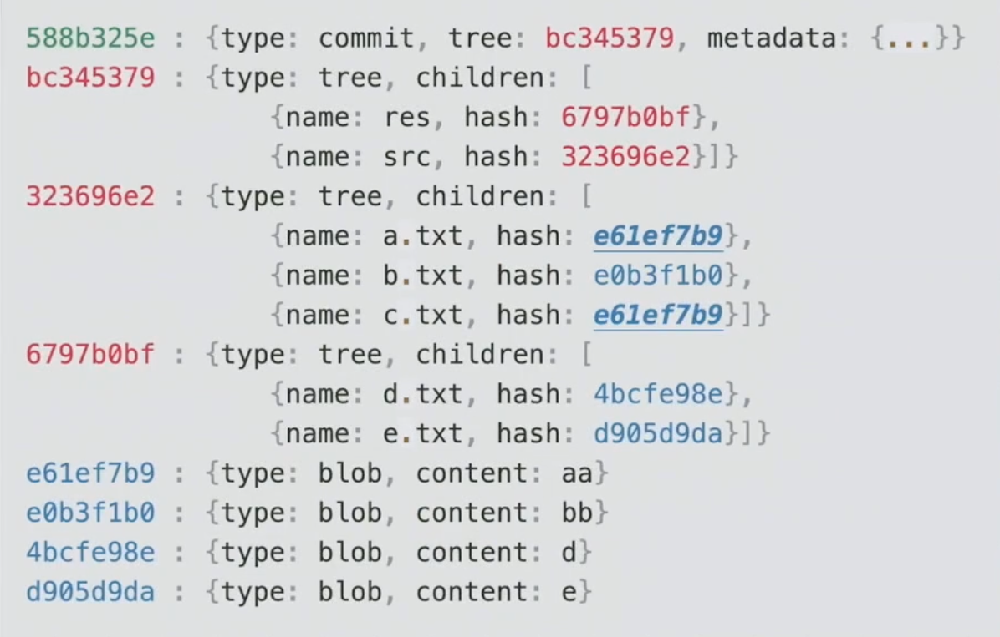
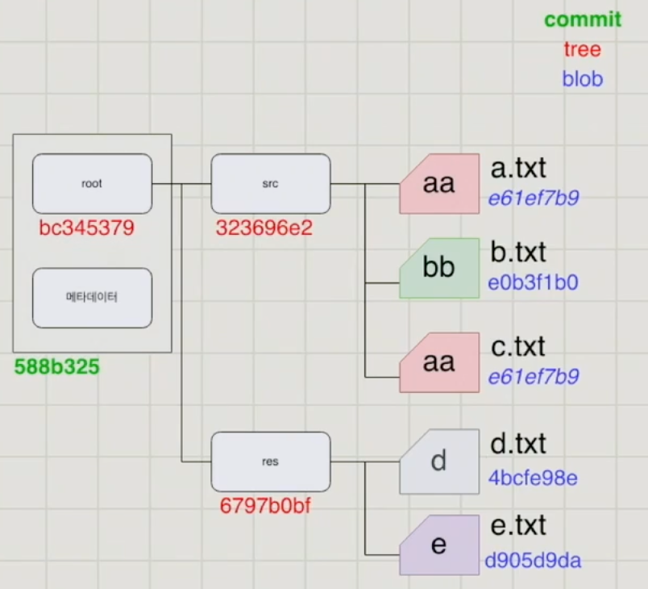

## Git Database

git 은 key-value 형태의 storage 를 사용  
git db 는 `insert`, `select` 만 실행됨 (`update`, `delete` 되지 않음)
커밋을 하게 되면 이미지와 같은 구조로 git database 에 저장  

### commit 구성 정보
- 메타데이터: 커밋 메세지, 작성자, 이메일, 날짜, 시간 등
- 프로젝트 스냅샷
- 부모 커밋의 `hash` 값 (최초의 커밋은 없을 수 있음)

### git objects

`git diff` 를 사용하게 되면 tree 구조에서 `hash` 값만을 비교하여 다른 내용의 파일을 찾음  
`hash` 를 비교하여 변경된 폴더만 찾기 때문에 빠른 성능을 보임

- blob (binary large object)
  - 파일의 내용을 담고 있는 객체 (파일 이름은 없음)
  - 파일의 내용을 해싱하여 키로 가짐
- tree
  - 디렉터리를 저장하는 객체, 파일의 이름을 저장
  - 파일의 `hash` 값과 파일의 이름을 해싱하여 키로 가짐
- commit
  - 프로젝트의 루트 트리의 `hash` 값, 부모 commit 의 `hash` 값, 메타데이터를 저장
  - 자식 commit 의 정보는 알지 못함

## Git References

`branch` 와 `tag` 는 특정 커밋의 hash 값을 저장하는 즐겨찾기 같은 역할  
`git reset` 은 `HEAD` 가 보고 있는 브랜치 이동, `--hard` 옵션을 추가하면 프로젝트 전체를 업데이트까지 함

- `tag`
  - 옮겨다니지 않음, 특정 커밋의 `hash` 값만 지정
  - `.git/refs/tags/*` 위치에 저장 (ex.`test` 태그를 추가하면 `.git/refs/tags/test` 파일 생성)
  - 파일 내부에는 지정된 커밋의 `hash` 값만 저장
- `branch`
  - 새로 만든 커밋으로 옮겨 다님
  - `.git/refs/heads/*` 위치에 저장 (ex.`.git/refs/heads/main` 은 `main` 브랜치를 의미)
  - 현재 자신이 보고 있는 브랜치는 `.git/HEAD` 파일에 저장 (ex.`ref: refs/heads/main`)
    - 직전 `HEAD` 의 hash 값을 저장하고 있는 파일은 `.git/ORIG_HEAD`    
  - 브랜치 이름에 `/` 가 존재하면 해당 디렉터리로 구분하게 됨 
  - `-c` 옵션을 사용하여 브랜치를 생성하면 `HEAD` 도 옮겨가게 됨 
- `log`
  - `.git/logs/HEAD` 라는 파일에 로그 정보가 남아있음
  - `HEAD` 가 최종적으로 지시하는 커밋의 해시값을 기록함
  - `git reflog` 명령어를 사용하면 로그 파일을 직접 열지 않아도 최신부터 역순으로 보여줌  

## Git Merge

- 머지된 새로운 커밋은 두 개의 커밋을 부모 커밋으로 가지게 됨
  - 두 개의 커밋을 부모로 가지고 있다면 머지 커밋이 됨
  - 세 개 이상의 커밋을 부모로 가질 순 없음
- 머지 과정에서 논리적인 모순이 있다면 충돌 발생
  - 충돌이 발생되면 직접 해결이 필요함

## Git Rebase

- `rebase`
  - 두 브랜치의 공통부모를 찾게 되고 그 공통 부모 이후의 커밋을 모두 가져와 순서대로 대상 브랜치에 적용함 
  - 머지와 다르게 커밋들의 연결구조를 변경하고 `HEAD` 도 옮겨감

- `cherry-pick`
  - 체리픽을 사용하면 원하는 커밋만 가져올 수 있음
  - `--ff` (fast-forward) 옵션을 사용하면 수정할 필요가 없어서 커밋을 새로 생성하지 않고 HEAD 만 변경됨
    - 자주 사용되는 옵션은 아니고 `rebase` 만으로도 가능함
  - `-n`(`--no-commmit`) 옵션을 추가하면 커밋을 하지 않고 변경만 남아있는 상태가 됨
  - `..` (ex. `a1..a3`) 을 사용하면 범위로 지정할 수 있음

## Git History 관리

- `git rebase -i {revision}`
  - `-i` (interactive) 옵션으로 `HEAD` 부터 해당 커밋까지의 히스토리 편집 가능
- `git revert {revision}`
  - 해당 커밋을 되돌리는 커밋을 생성
- `git reset {revision}`
  - 해당 커밋을 가리키는 버전으로 이동
  - `--hard` 옵션을 추가하면 프로젝트 전체를 업데이트